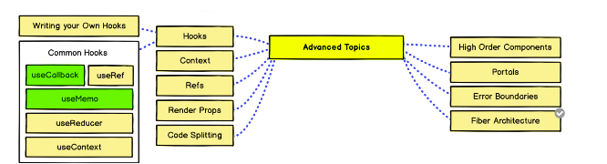

[![Contributors][contributors-shield]][contributors-url]
[![Forks][forks-shield]][forks-url]
[![Stargazers][stars-shield]][stars-url]
[![LinkedIn][linkedin-shield]][linkedin-url]

  

  <h3 align="center">react-advanced-topics</h3>

  

    In this repository i'll try to practice the advanced topics from the react roadmap. Each topic that i've studied and practiced will be marked as green.
     
     
  

## Contact

| Social networks  | URL |
| ------------- | -------- |
| Email | sudo.von.contact@gmail.com |

<!-- MARKDOWN LINKS & IMAGES -->
<!-- https://www.markdownguide.org/basic-syntax/#reference-style-links -->
[contributors-shield]: https://img.shields.io/github/contributors/sudo-von/react-advanced-topics.svg?style=for-the-badge
[contributors-url]: https://github.com/sudo-von/react-advanced-topics/graphs/contributors
[forks-shield]: https://img.shields.io/github/forks/sudo-von/react-advanced-topics.svg?style=for-the-badge
[forks-url]: https://github.com/sudo-von/react-advanced-topics/network/members
[stars-shield]: https://img.shields.io/github/stars/sudo-von/react-advanced-topics.svg?style=for-the-badge
[stars-url]: https://github.com/sudo-von/react-advanced-topics/stargazers
[issues-shield]: https://img.shields.io/github/issues/sudo-von/react-advanced-topics.svg?style=for-the-badge
[issues-url]: https://github.com/sudo-von/react-advanced-topics/issues
[license-shield]: https://img.shields.io/github/license/sudo-von/react-advanced-topics.svg?style=for-the-badge
[license-url]: https://github.com/sudo-von/react-advanced-topics/blob/master/LICENSE.txt
[linkedin-shield]: https://img.shields.io/badge/-LinkedIn-black.svg?style=for-the-badge&logo=linkedin&colorB=555
[linkedin-url]: https://www.linkedin.com/in/jes%C3%BAs-%C3%A1ngel-rodr%C3%ADguez-mart%C3%ADnez-84991a1b4/
